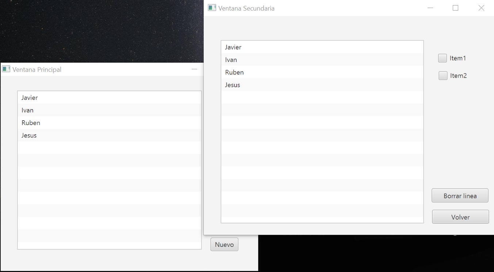
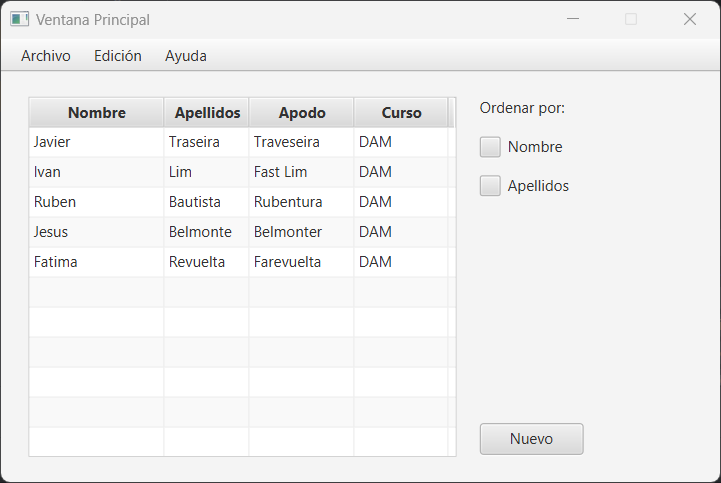

# Práctica 7.4 Gestión de objetos en ventanas múltiples en JavaFX

Dado el **código base** de un proyecto en la carpeta *Modelos* en este mismo repositorio (para *IntelliJ IDEA*) de dos ventanas que hacen uso del MVC con sus correspondientes elementos ya declarados.

## Parte 1

Realiza las modificaciones necesarias para que las dos ventanas, que utilizan el elemento **ListView**, se comuniquen entre sí, es decir, que los cambios en una lleguen a la otra.
- Agregar dos **checkbox** en las ventanas y que sus valores marcados se actualicen entre las ventanas. 

## Parte 2

Mejora el ejercicio anterior para conseguir lo siguiente:

- Agrega una nueva funcionalidad para añadir un **botón** que permita añadir elementos al listado desde la ventana secundaria.
- Agrega una funcionalidad para permitir ordenar por las columnas indicadas en el checkbox concreto.
- Haz las modificaciones necesarias para agregar un **TableView** en vez de un **ListView** con varias columnas.
- Agrega un botón editar para modificar los valores de una línea concreta. 

