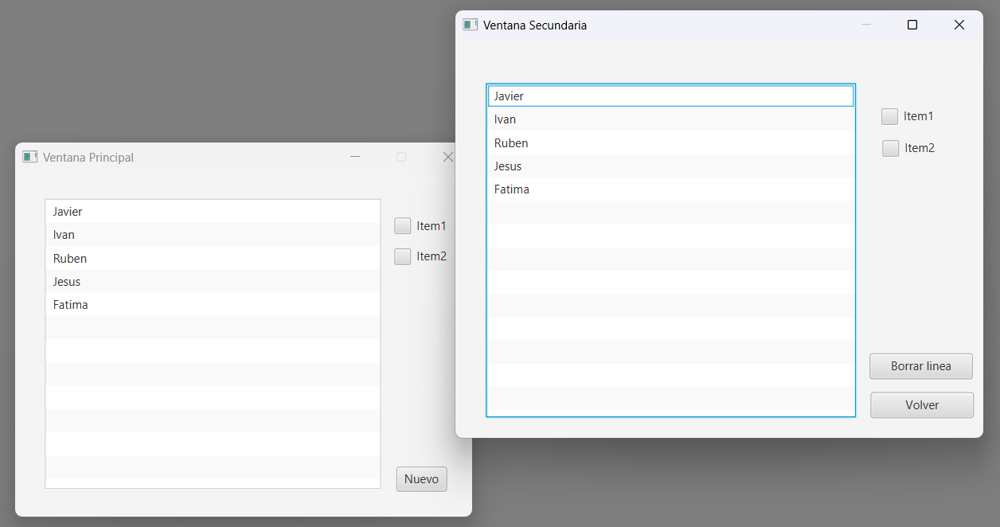

# Práctica 7.4 Modificación de objetos entre ventanas en JavaFX

Dado el código base de un proyecto en este repositorio (*MVCJavaFX1-main*) de dos ventanas que hacen uso del MVC con sus correspondientes elementos ya declarados.

# Parte 1

Realiza las modificaciones necesarias para que las dos ventanas, que utilizan el elemento *ListView,* se comuniquen entre sí y los cambios en una lleguen a los de la otra.

# Parte 2

Mejora el ejercicio anterior para conseguir lo siguiente:
- Agregar dos *checkbox* en las ventanas y que sus valores marcados se actualicen entre las ventanas. 
- Haz también lo propio con otrocampo de tipo Textfield.
- Prueba añadir combobox (opcional)